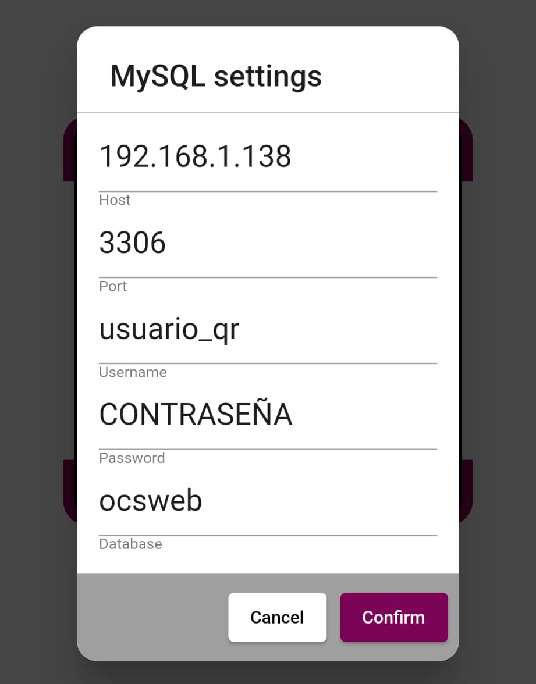
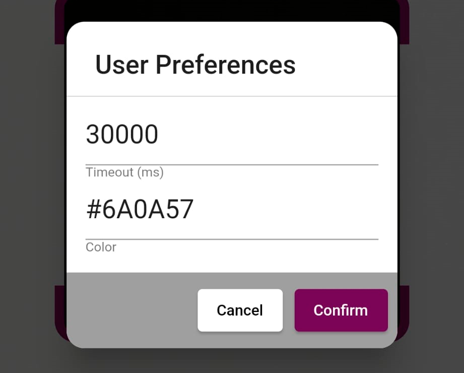
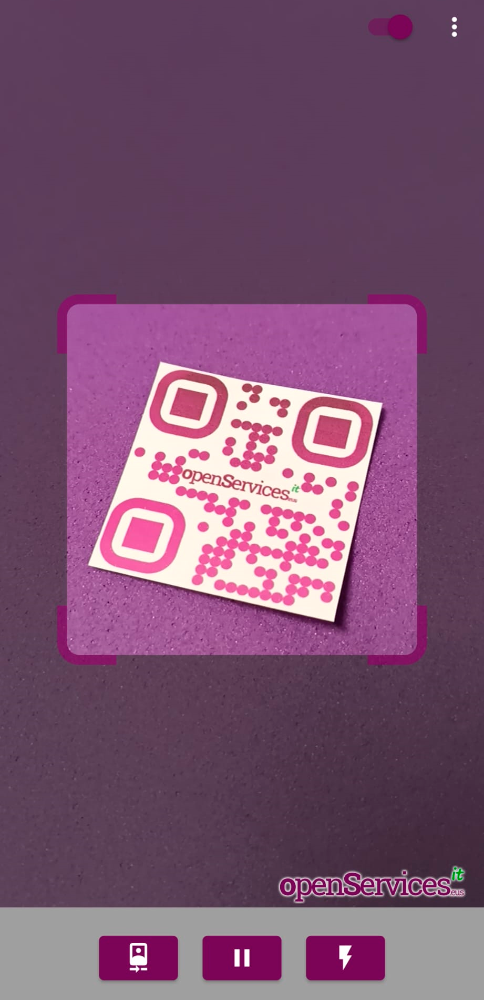
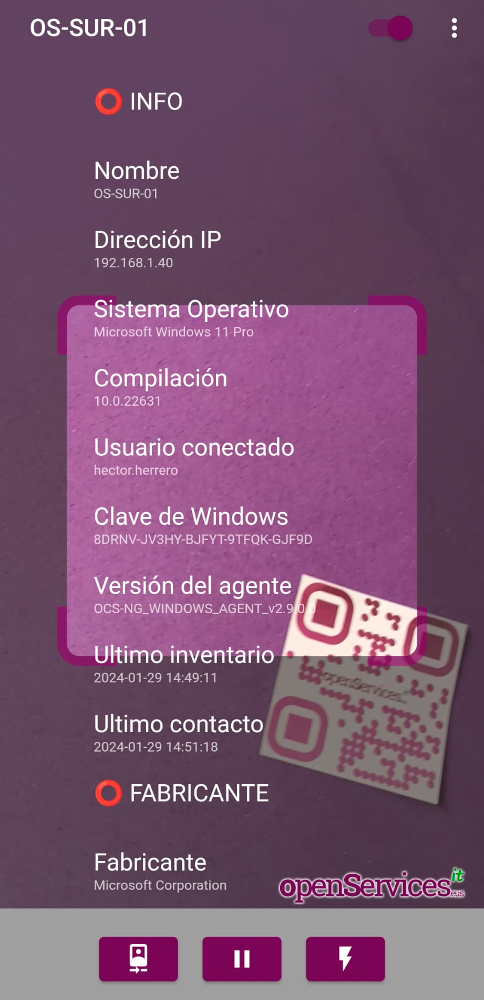

# OSit QRinvent

OSit QRinvent es una app que funciona en Android y permite escanear códigos QR que tengamos pegados en los elementos core de nuestra organización, sea en equipos de sobremesa, portátiles, servidores, cabinas de almacenamiento... con el objetivo de visualizar en tiempo real sus datos de inventario hardware o software.

OSit QRinvent obtiene la información del sistema de inventario OCS Inventory NG, por tanto, si dispones de tu infraestructura inventariada (y eres feliz) podrás bajarte la app y usarla de manera gratuita YA. Es una app de código abierto, no tiene publicidad y viene sin soporte.

OSit QRinvent tiene una hermana llamada OSit QRmonitor que muestra datos de monitorización en tiempo real, más info: https://github.com/srlopez/qrinvent

## Cómo funciona

Es muy simple, al abrir la app directamente mostrará la cámara del Android, con ella escanearemos un código QR que tengamos pegado en un dispositivo inventariador con OCS Inventory. En el momento de leer el código QR mostrará en pantalla un inventario completo con todo el hardware y el software del equipo escaneado.

## Qué necesitamos

Podremos usar cualquier generador de códigos QR para las pegatinas, como puedan ser webs que ofrecen dicho servicio gratuito. Al generar los códigos QR, tendremos que tener en cuenta que cada código QR devolverá una palabra únicamente, siendo esta, el nombre de su equipo en OCS Inventory.

La versión inicial de OSit QRinvent (v. 0.0.1) sólo permite conectar a OCS Inventory mediante una conexión MySQL, por tanto, será necesario crear un usuario de lectura en la BD de OCS Inventory y tener conectividad a ella.

## Qué podemos ver

Como indicamos, al escanear un código QR se mostrará en pantalla todo el hardware y software de dicha máquina. Gracias a OCS Inventory NG sabemos que podemos tener un inventario actualizado de cualquier componente hardware o software instalado en nuestras máquinas, pues ahora, lo podemos ver en tiempo real y desde cualquier sitio, delante de un equipo, de un servidor y conocer cualquier detalle que necesitemos de su hardware, como pueda ser qué discos tiene, su capacidad, su número de serie, o cuántos módulos de memoria RAM tiene ocupados, o si tiene un software instalado y qué versión.

 - Información genérica:
- Nombre del equipo.
- Dirección IP.
- Sistema Operativo.
- Compilación del S.O.
- Usuario conectado.
- Clave de Windows.
- Versión del agente de inventario.
- Fecha del último inventario.
- Fecha del último contacto.
 - Fabricante:
- Fabricante.
- Modelo.
- Nº de serie.
- Versión de la BIOS.
- Fecha de la BIOS.
 - Procesador:
- Procesador.
- Nº de procesadores.
- Nº de cores.
 - Memoria:
- Memoria total.
- Slots ocupados.
- Slots libres.
- Almacenamiento:
 - Disco:
- Capacidad.
- Versión del firmware.
 - Unidades:
- Letra de unidad.
- Sistema de archivos.
- Espacio libre.
- Espacio ocupado.
 - Controladoras:
- Controladora.
- Fabricante.
- Tipo de controladora.
 - Adaptadores de red:
- Nombre del adaptador.
- Dirección MAC.
- Dirección IP.
- Máscada de red.
- Puerta de enlace.
- Servidor DHCP.
*   Tarjetas gráficas:
- Modelo.
- Memoria.
- Resolución.
*   Monitores:
- Modelo.
- Número de serie.
- Tipo monitor.
- Descripción.
*   Impresoras:
- Nombre de impresora.
- Driver.
- Puerto.
- Compartida.
- Impresora de red.
*   Software instalado:
- Nombre del software.
- Fabricante del software.
- Versión del software.

## Wiki

### Requisitos en OCS Inventory NG

La v. 0.0.1 de OSit QRinvent conecta directamente al motor de base de datos de OCS Inventory, MySQL, por tanto, será necesario crear un usuario específico en la BD de OCS Inventory, con permisos de lectura únicamente. Lo podremos hacer desde la shell del servidor de BBDD, conectando con el comando 'mysql' y las siguientes 2 instrucciones, deberemos indicar un usuario y una contraseña de nuestro interés.

    CREATE USER 'usuario_qr'@'%' IDENTIFIED BY 'CONTRASEÑA';
    grant SELECT ON ocsweb.* to 'usuario_qr'@'%';

**Nota**: Si sabemos la dirección IP desde donde se van a conectar los Android, se podría indicar y no abrir a todo.

**Nota 2**: Desconocemos el versionado de OCS Inventory necesario, está validado con la última al escribir estas notas, 2.12.0, entendemos que será compatible con versiones anteriores y futuras.

### Configurar la app

Una vez dispongamos de la app instalada en nuestro dispositivo Android, podremos configurar la conexión a MySQL desde los 3 puntos en la esquina superior derecha en la opción "DB Params",

Ahí deberemos establecer la dirección IP del servidor con la BD de OCS Inventory, el puerto de conexión, así como los credenciales y el nombre de la base de datos.

En las 'User Preferences', podremos configurarnos un Timeout donde especificaremos el tiempo que queremos que dure el QR en pantalla (en ms), por defecto 0, ilimitado. Así como la posibilidad de cambiar el color del tema de la app.

### Uso de la app

Como sabemos ya, la finalidad de la app será escanear unos códigos QR que nos podremos auto generar y personalizar, Del QR obtendrá la palabra con el nombre de la máquina que tengamos en OCS Inventory. Será tan sencillo cómo escanear un QR.

Y nos mostrará inmediatamente, el nombre de la máquina y unos primeros datos con la Información genérica, haciendo scroll con el dedo veremos el resto de información. Bastará con escanear otro código QR y la pantalla se actualizará automáticamente, o, podremos pulsar sobre el nombre de la máquina en la parte superior izquierda y se limpiará la pantalla.

En la parte inferior se dispone de 3 botones, uno para cambiar de cámara, otro para pausar la imagen, y el tercero para activar el flash si es que lo necesitamos.

## FAQ

### Web para generar QR

Por ejemplo se puede usar QRCODEMONKEY: [https://www.qrcode-monkey.com](https://www.qrcode-monkey.com)

Leerá cualquier tipo de diseño de un código QR de formato TEXTO.

### ¿Es seguro?

Sabemos que en esto de IT no hay nada seguro, así que queda a tu elección, simplemente se ha creado un usuario con permisos de lectura en tu BD de OCS Inventory. 

Los códigos QR no revelan información confidencial, por lo que, si cualquier usuario (que no disponga de la app) escanea un código QR nuestro, mostrarán el nombre del dispositivo exclusivamente; los datos están en la BD.

### ¿Futuro?

¿Habrán nuevas versiones con nuevas funcionalidades?¿Habrán nuevas apps que hagan otras cosas molonguis? Quién sabe, alguna idea loca queda, pero... _tempus fugit_.

### Licenciamiento

Cómo indicamos OSit QRinvent es gratuita y de código abierto, que podrá ser usada por cualquier persona o empresa.

Con una única condición, los proveedores de IT no tienen derecho de modificar el código de la app, ni para su uso particular, ni la de sus clientes; ni por supuesto vender la app o derivados de esta. ;-)

### Descarga

Para poder acceder al APK compilado e instalártelo en tu Android, podrás hacerlo desde aquí: https://www.bujarra.com/osit-qrinvent

### Contacto

Estamos en https://www.openservices.eus